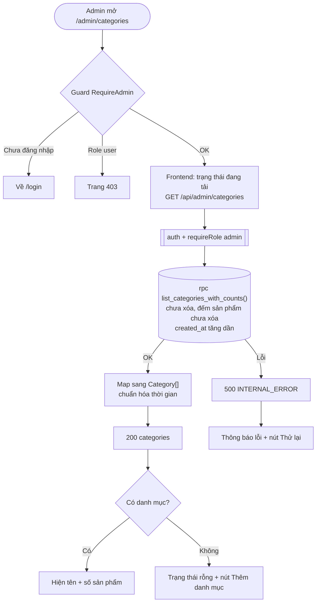

# Luồng: Xem danh sách danh mục

> US-03 §4.1, E1, E2, E8, AC-01, AC-09 · `GET /api/admin/categories`

```mermaid
flowchart TD
  U([Admin mở /admin/categories]) --> G{"Guard RequireAdmin"}
  G -- "Chưa đăng nhập" --> L[Về /login]
  G -- "Role user" --> F403[Trang 403]
  G -- OK --> F1["Frontend: trạng thái đang tải<br/>GET /api/admin/categories"]
  F1 --> B1[["auth + requireRole admin"]]
  B1 --> D1[("rpc list_categories_with_counts()<br/>chưa xóa, đếm sản phẩm chưa xóa<br/>created_at tăng dần")]
  D1 -- Lỗi --> E1[500 INTERNAL_ERROR]
  D1 -- OK --> B2["Map sang Category[]<br/>chuẩn hóa thời gian"]
  B2 --> OK[200 categories]
  OK --> F2{"Có danh mục?"}
  F2 -- Có --> F3[Hiện tên + số sản phẩm]
  F2 -- Không --> F4["Trạng thái rỗng + nút Thêm danh mục"]
  E1 --> F5[Thông báo lỗi + nút Thử lại]
```
